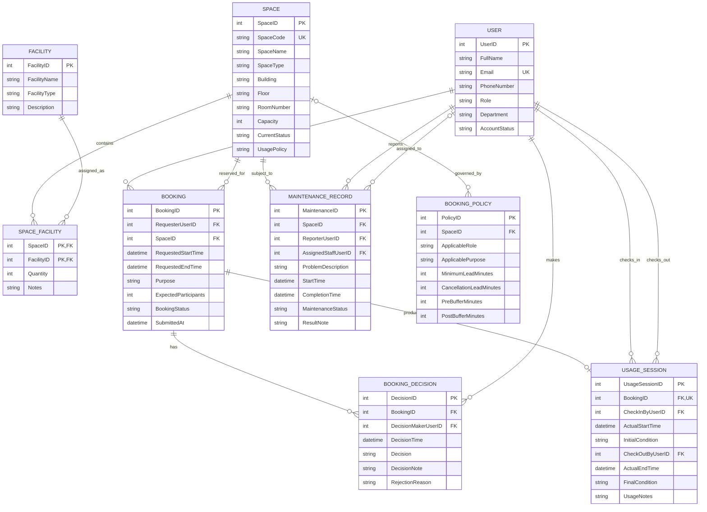

# CSMS Conceptual Database Design (ERD)

## 1. Entity Set Definitions

| Entity set | Key attributes | Conceptual notes |
|---|---|---|
| User | UserID, Email | University-account holder; Role and AccountStatus control authorization. |
| Space | SpaceID, SpaceCode | Bookable physical space with location, capacity, status, and usage policy. Location comprises Building, Floor, and RoomNumber. |
| Facility | FacilityID | Reusable facility/equipment type, such as a projector or whiteboard. |
| SpaceFacility | SpaceID, FacilityID | Associative entity recording a facility type and optional quantity/notes in a space. |
| Booking | BookingID | Request for one space and interval; holds purpose, expected participants, lifecycle status, and submitted time. Duration is derived. |
| BookingDecision | DecisionID | Immutable approval/rejection decision history, including decision maker, time, note, and rejection reason. |
| UsageSession | UsageSessionID | Optional weak/dependent record for an actual check-in/out; actual duration is derived. |
| MaintenanceRecord | MaintenanceID | Reported problem, active interval, optional assignee, completion, status, and result note for one space. |
| BookingPolicy | PolicyID | Configurable lead time, cancellation deadline, and pre/post buffers applicable to a space and/or role/purpose. |

`Booking` and `MaintenanceRecord` are historical transaction entities. `UsageSession` is existence-dependent on `Booking`; a booking may have at most one usage session. Controlled attributes include roles, account status, space type/status, booking purpose/status, and maintenance status.

## 2. Relationship & Participation Constraints Matrix

| Relationship | Cardinality and participation | Meaning |
|---|---|---|
| User submits Booking | User 0..N — Booking 1..1 | Every booking has exactly one requester; a user may make no bookings. |
| Space is reserved by Booking | Space 0..N — Booking 1..1 | Every booking selects exactly one space. |
| Booking has BookingDecision | Booking 0..N — Decision 1..1 | A pending request has no decision; every decision belongs to one booking. |
| User makes BookingDecision | User 0..N — Decision 1..1 | Each decision records one authorized actor. |
| Booking produces UsageSession | Booking 0..1 — UsageSession 1..1 | A session occurs only after check-in. |
| User checks in/out UsageSession | User 0..N — UsageSession 1..1 per action | Check-in and check-out actors are retained independently and may differ. |
| Space contains Facility | Space 0..N — Facility 0..N via SpaceFacility | Equipment inventory is many-to-many. |
| Space is subject to MaintenanceRecord | Space 0..N — MaintenanceRecord 1..1 | Each maintenance record affects exactly one space. |
| User reports/receives MaintenanceRecord | User 0..N — Record 1..1 reporter; User 0..N — Record 0..1 assignee | Reporting is mandatory; assignment is optional until staff is allocated. |
| BookingPolicy governs Space | Policy 0..N — Space 0..N | Policies can be global (no space), space-specific, or parameterized by role/purpose. |

## 3. Conceptual Entity-Relationship Diagram

The diagram uses `||` for mandatory one, `o|` for optional one, and `o{` for zero or many. Availability is a cross-entity business constraint: an approved/checked-in booking cannot overlap another approved/checked-in booking or active maintenance for the same space; closed, maintenance, and retired spaces are non-bookable.
