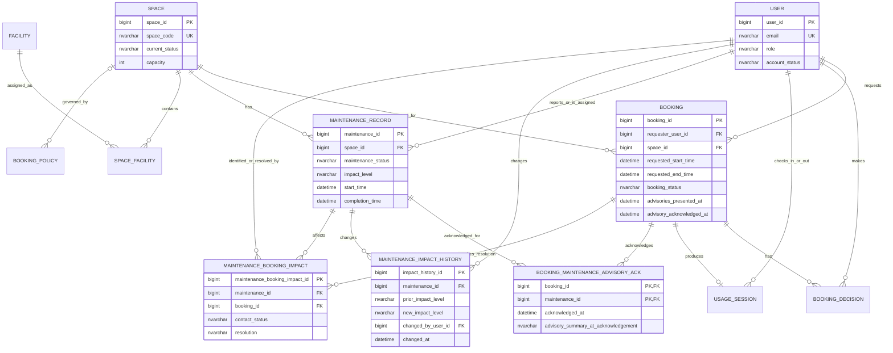

# CSMS Updated ERD and Logical Database Design — Group 13

## 1. Design Scope and Modelling Decisions

This Phase 2 logical design extends the Group 13 CSMS model for maintenance impact levels, advisory acknowledgement, escalation impact tracking, and safe concurrent approval. All identifiers are `BIGINT` surrogate keys except `SpaceFacility` and `BookingMaintenanceAdvisoryAcknowledgement`, whose composite keys express their natural uniqueness. Timestamps use `DATETIME2(0)`.

`MaintenanceRecord.impact_level` determines interval-level availability. `Space.current_status` remains an operational status and must not mark a space unavailable merely because an advisory exists. A booking records the time at which the requester confirmed an advisory disclosure, while the normalized acknowledgement junction retains the authoritative acknowledgement of each advisory. This supports any number of concurrent advisories without repeating maintenance data in `Booking`.

## 2. Updated Logical ERD



### Cardinality and participation

| Relationship | Cardinality | Constraint meaning |
|---|---|---|
| Space — MaintenanceRecord | 1 : 0..N | Every maintenance record concerns exactly one space. |
| Booking — AdvisoryAcknowledgement — MaintenanceRecord | 0..N : 1 : 0..N | Each acknowledgement belongs to one booking and one maintenance record; a booking can acknowledge multiple advisories. |
| MaintenanceRecord — MaintenanceImpactHistory | 1 : 0..N | The current impact level is on the maintenance record; each change is immutable history. |
| MaintenanceRecord — MaintenanceBookingImpact — Booking | 0..N : 1 : 0..N | An escalation can affect several bookings and a booking can be affected by separate maintenance events. |
| Booking — BookingDecision | 1 : 0..N | A pending request has no decision. Approval, rejection, and auto-approval remain auditable. |

## 3. Relational Schema

`PK` marks a primary key, `FK` a foreign key, `UQ` a candidate/unique key, and `NN` a non-null attribute.

```text
User(
  user_id BIGINT PK,
  full_name NVARCHAR(150) NN,
  email NVARCHAR(254) NN UQ,
  phone_number NVARCHAR(30),
  role NVARCHAR(30) NN,
  department NVARCHAR(100) NN,
  account_status NVARCHAR(20) NN
)

Space(
  space_id BIGINT PK,
  space_code NVARCHAR(30) NN UQ,
  space_name NVARCHAR(150) NN,
  space_type NVARCHAR(40) NN,
  building NVARCHAR(80) NN,
  floor NVARCHAR(20) NN,
  room_number NVARCHAR(30) NN,
  capacity INT NN,
  current_status NVARCHAR(30) NN,
  usage_policy NVARCHAR(1000)
)

Facility(
  facility_id BIGINT PK,
  facility_name NVARCHAR(100) NN,
  facility_type NVARCHAR(50) NN,
  description NVARCHAR(500),
  UQ(facility_name, facility_type)
)

SpaceFacility(
  space_id BIGINT PK FK -> Space(space_id),
  facility_id BIGINT PK FK -> Facility(facility_id),
  quantity INT NN,
  notes NVARCHAR(500)
)

BookingPolicy(
  policy_id BIGINT PK,
  space_id BIGINT FK -> Space(space_id),
  applicable_role NVARCHAR(30),
  applicable_purpose NVARCHAR(40),
  auto_approval_enabled BIT NN,
  minimum_lead_minutes INT NN,
  cancellation_lead_minutes INT NN,
  pre_buffer_minutes INT NN,
  post_buffer_minutes INT NN,
  UQ(space_id, applicable_role, applicable_purpose)
)

Booking(
  booking_id BIGINT PK,
  requester_user_id BIGINT NN FK -> User(user_id),
  space_id BIGINT NN FK -> Space(space_id),
  requested_start_time DATETIME2(0) NN,
  requested_end_time DATETIME2(0) NN,
  purpose NVARCHAR(40) NN,
  expected_participants INT NN,
  booking_status NVARCHAR(20) NN,
  submitted_at DATETIME2(0) NN,
  advisories_presented_at DATETIME2(0),
  advisory_acknowledged_at DATETIME2(0),
  cancelled_at DATETIME2(0),
  cancelled_by_user_id BIGINT FK -> User(user_id),
  cancellation_note NVARCHAR(1000)
)

BookingDecision(
  decision_id BIGINT PK,
  booking_id BIGINT NN FK -> Booking(booking_id),
  decision_maker_user_id BIGINT NN FK -> User(user_id),
  decision_time DATETIME2(0) NN,
  decision NVARCHAR(20) NN,
  decision_note NVARCHAR(1000),
  rejection_reason NVARCHAR(1000)
)

UsageSession(
  usage_session_id BIGINT PK,
  booking_id BIGINT NN UQ FK -> Booking(booking_id),
  check_in_by_user_id BIGINT NN FK -> User(user_id),
  actual_start_time DATETIME2(0) NN,
  initial_condition NVARCHAR(1000) NN,
  check_out_by_user_id BIGINT FK -> User(user_id),
  actual_end_time DATETIME2(0),
  final_condition NVARCHAR(1000),
  usage_notes NVARCHAR(1000)
)

MaintenanceRecord(
  maintenance_id BIGINT PK,
  space_id BIGINT NN FK -> Space(space_id),
  reporter_user_id BIGINT NN FK -> User(user_id),
  assigned_staff_user_id BIGINT FK -> User(user_id),
  problem_description NVARCHAR(2000) NN,
  start_time DATETIME2(0) NN,
  completion_time DATETIME2(0),
  maintenance_status NVARCHAR(30) NN,
  impact_level NVARCHAR(20) NN,
  result_note NVARCHAR(2000)
)

BookingMaintenanceAdvisoryAcknowledgement(
  booking_id BIGINT PK FK -> Booking(booking_id),
  maintenance_id BIGINT PK FK -> MaintenanceRecord(maintenance_id),
  acknowledged_at DATETIME2(0) NN,
  advisory_summary_at_acknowledgement NVARCHAR(2000)
)

MaintenanceImpactHistory(
  impact_history_id BIGINT PK,
  maintenance_id BIGINT NN FK -> MaintenanceRecord(maintenance_id),
  prior_impact_level NVARCHAR(20),
  new_impact_level NVARCHAR(20) NN,
  changed_by_user_id BIGINT NN FK -> User(user_id),
  changed_at DATETIME2(0) NN,
  change_note NVARCHAR(1000) NN
)

MaintenanceBookingImpact(
  maintenance_booking_impact_id BIGINT PK,
  maintenance_id BIGINT NN FK -> MaintenanceRecord(maintenance_id),
  booking_id BIGINT NN FK -> Booking(booking_id),
  identified_at DATETIME2(0) NN,
  identified_by_user_id BIGINT NN FK -> User(user_id),
  contact_status NVARCHAR(30) NN,
  contacted_at DATETIME2(0),
  resolved_at DATETIME2(0),
  resolved_by_user_id BIGINT FK -> User(user_id),
  resolution NVARCHAR(30),
  resolution_note NVARCHAR(1000),
  UQ(maintenance_id, booking_id)
)
```

## 4. Keys, Domain Constraints, and Integrity Rules

### 4.1 Controlled values and row-level checks

| Relation | Constraint |
|---|---|
| `User` | `role IN ('Student','Lecturer','TA','FacilityStaff','DeptAdmin','FacilityManager')`; `account_status IN ('Active','Inactive','Suspended')`. |
| `Space` | Positive capacity; controlled type and `current_status` values. |
| `BookingPolicy` | All minute values non-negative; `auto_approval_enabled` is required. |
| `Booking` | `requested_end_time > requested_start_time`; positive participants; controlled purpose/status; a cancelled status requires cancellation actor/time. If `advisory_acknowledged_at` is present, `advisories_presented_at` must be present and not later. |
| `BookingDecision` | `decision IN ('Approved','Rejected','AutoApproved')`; rejected decisions require a rejection reason. |
| `UsageSession` | Actual end is later than actual start; checkout actor/final condition are present exactly when actual end exists. |
| `MaintenanceRecord` | `impact_level IN ('advisory','out-of-service')`; controlled status; completed records require completion time/result and `completion_time >= start_time`. |
| `MaintenanceImpactHistory` | New impact is controlled; `prior_impact_level` is null only for the initial creation audit entry. |
| `MaintenanceBookingImpact` | Controlled `contact_status` (e.g. `PendingContact`, `Contacted`, `Resolved`); controlled resolution (`Rescheduled`, `Relocated`, `Cancelled`, `AcceptedRisk`); resolution actor/time are mandatory when resolution is present. |

### 4.2 Cross-table business constraints

Foreign keys protect entity existence. The following rules require a stored procedure or trigger because they depend on other rows or on time intervals.

1. A `BookingMaintenanceAdvisoryAcknowledgement` may be inserted only when the booking and maintenance record reference the same `space_id`, their intervals overlap, and the maintenance record is an active `advisory` at acknowledgement time.
2. When approval is attempted, every currently overlapping active advisory must have an acknowledgement row for that booking. The booking-level timestamp is an audit marker only; it is not proof of acknowledgement completeness.
3. An approved or checked-in booking must not overlap another approved/checked-in booking for the same space, including configured pre/post buffers.
4. An approved or checked-in booking must not overlap an active `out-of-service` maintenance interval. Advisory records are returned as warnings rather than blocks.
5. Only an active maintenance record may be escalated/downgraded. A change writes one `MaintenanceImpactHistory` row. Escalation to `out-of-service` inserts an impact row for every overlapping approved booking; insertion is idempotent through `UQ(maintenance_id, booking_id)`.
6. A booking approval, auto-approval, and maintenance impact-level change acquire the same transaction-owned lock keyed by `space_id`, re-read the relevant rows, and commit atomically. This prevents both double approval and approval concurrent with escalation.

## 5. Concurrency Boundary and Supporting Indexes

The logical model represents concurrency tracking through immutable decision, acknowledgement, impact-history, and impact-work-item rows. Actual mutual exclusion is an operational integrity rule, not a new entity: approval and escalation procedures use `sp_getapplock` with resource `CSMS:Space:<space_id>` and `@LockOwner = 'Transaction'`. This serializes all availability-changing work for one space while allowing independent spaces to proceed concurrently.

Recommended indexes are:

```text
Booking(space_id, booking_status, requested_start_time, requested_end_time)
MaintenanceRecord(space_id, maintenance_status, impact_level, start_time, completion_time)
BookingMaintenanceAdvisoryAcknowledgement(booking_id, maintenance_id)
MaintenanceBookingImpact(maintenance_id, booking_id) UNIQUE
SpaceFacility(facility_id, space_id)
```

The first two indexes support the locked overlap rechecks; `SpaceFacility` supports the room finder. The acknowledgement and impact indexes make completeness checks and escalation reporting efficient.

## 6. Functional Dependencies

The principal functional dependencies (FDs) follow from declared keys and unique constraints. Attributes not listed as determinants are non-key descriptive attributes of the determinant's relation.

| Relation | Candidate key(s) | Non-trivial FDs |
|---|---|---|
| `User` | `{user_id}`, `{email}` | `user_id -> full_name, email, phone_number, role, department, account_status`; `email -> user_id, full_name, phone_number, role, department, account_status`. |
| `Space` | `{space_id}`, `{space_code}` | `space_id -> space_code, space_name, space_type, building, floor, room_number, capacity, current_status, usage_policy`; `space_code ->` the same attributes. |
| `Facility` | `{facility_id}`, `{facility_name, facility_type}` | Each candidate key determines `description` and the alternate identifier. |
| `SpaceFacility` | `{space_id, facility_id}` | `{space_id, facility_id} -> quantity, notes`. |
| `BookingPolicy` | `{policy_id}`, `{space_id, applicable_role, applicable_purpose}` | Each candidate key determines the auto-approval and timing/buffer values. |
| `Booking` | `{booking_id}` | `booking_id ->` all remaining booking attributes. |
| `BookingDecision` | `{decision_id}` | `decision_id -> booking_id, decision_maker_user_id, decision_time, decision, decision_note, rejection_reason`. |
| `UsageSession` | `{usage_session_id}`, `{booking_id}` | Each candidate key determines all session attributes. |
| `MaintenanceRecord` | `{maintenance_id}` | `maintenance_id ->` all remaining maintenance attributes, including `impact_level`. |
| `BookingMaintenanceAdvisoryAcknowledgement` | `{booking_id, maintenance_id}` | `{booking_id, maintenance_id} -> acknowledged_at, advisory_summary_at_acknowledgement`. |
| `MaintenanceImpactHistory` | `{impact_history_id}` | `impact_history_id -> maintenance_id, prior_impact_level, new_impact_level, changed_by_user_id, changed_at, change_note`. |
| `MaintenanceBookingImpact` | `{maintenance_booking_impact_id}`, `{maintenance_id, booking_id}` | Each candidate key determines identified/contact/resolution attributes. |

Business predicates such as interval overlap, active state, actor authority, and advisory completeness are deliberately not expressed as FDs: they are temporal/cross-relation integrity rules.

## 7. Third Normal Form Validation

For 3NF, every non-trivial FD `X -> A` must have either a superkey determinant `X`, or a prime dependent attribute `A`.

| Relation group | 3NF proof |
|---|---|
| `User`, `Space`, `Facility`, `Booking`, `BookingDecision`, `MaintenanceRecord`, `MaintenanceImpactHistory` | The only non-trivial determinants are candidate keys (`user_id`/`email`, `space_id`/`space_code`, or the declared identity key). Each determinant is a superkey; therefore 3NF holds. |
| `SpaceFacility`, `BookingMaintenanceAdvisoryAcknowledgement` | The composite primary key is the only determinant and determines its descriptive attributes. Neither individual foreign key determines a non-key attribute, so there is no partial or transitive dependency. Both relations are in 3NF (and BCNF). |
| `BookingPolicy` | `policy_id` and the declared scope tuple are candidate keys; each determines only policy values. The nullable scope components are handled by a SQL Server unique-index design appropriate for the chosen policy-precedence representation. No policy value determines another non-key value. Thus 3NF holds. |
| `UsageSession` | Both `usage_session_id` and the unique `booking_id` are candidate keys. Each determines session attributes, and no non-key attribute determines another. 3NF holds. |
| `MaintenanceBookingImpact` | Both the surrogate key and `UQ(maintenance_id, booking_id)` are candidate keys. Contact and resolution attributes depend on the whole impact occurrence, not on maintenance or booking alone. 3NF holds. |

The booking-level `advisories_presented_at` and `advisory_acknowledged_at` are event facts about the disclosure confirmation interaction. They are not a stored `has_acknowledgements` flag derived from child rows. Completeness is always evaluated from `BookingMaintenanceAdvisoryAcknowledgement`; therefore no update anomaly is introduced and the `Booking` relation remains in 3NF.

## 8. Mapping to Phase 2 Behaviour

| Requirement | Logical-model enforcement |
|---|---|
| Advisory remains bookable but requester is informed | Booking disclosure timestamps plus one acknowledgement row per active overlapping advisory. |
| Multiple concurrent maintenance records | `MaintenanceRecord` is one-to-many from `Space`; acknowledgement junction has no one-advisory limitation. |
| Escalation/downgrade during active maintenance | Controlled `impact_level`, immutable `MaintenanceImpactHistory`, and a transactionally protected update operation. |
| Escalation identifies approved bookings | `MaintenanceBookingImpact` records each detected `(maintenance_id, booking_id)` pair uniquely for staff follow-up. |
| No overlapping approved bookings under load | Shared per-space transactional locking, conflict index, revalidation, and immutable `BookingDecision` history. |

This design is normalized to at least 3NF while retaining the historical data required to prove notice, trace impact-level changes, and resolve bookings disrupted by a later outage.
